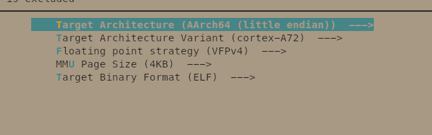

# Initial Setup

DISCLAIMER: As I don't particularly like VSCode, I've decided to not use the devcontainer instructions and instead install and run everything natively on Fedora 44. 

## Part 1 : Install the development environment for the target system 

I've decide to setup my work environment with a main repository where I'll be able to store the lab journal alongside the lab resources and buildroot.
The lab resources and buildroot are two submodules on the root of the repository

```bash
mkdir ma-ses
cd ma-ses
git init .
git submodule add https://github.com/MA-SeS/resources.git
git submodule add https://github.com/buildroot/buildroot.git
git -C buildroot checkout -b local-lts 2025.02.17
# submodule add automatically adds .gitmodules and the submodule folder to staging,
# we just need to add the buildroot folder after the checkout
git add buildroot
git commit -m "chore: setup buildroot and lab resources as git submodules"
```

The repository is available [here](https://github.com/MSE-AndreCosta/ma-ses). The remote was setup using the following commands:

```bash
git remote add origin git@github.com:MSE-AndreCosta/ma-ses.git
git branch -M main
git push -u origin main
```


## Part 2 : Generate a vanilla SD card image, then a custom one

*Go to the buildroot directory and start by listing all the target configurations provided by Buildroot.*

```bash
cd buildroot
make list-defconfigs | grep raspberrypi4
  raspberrypi4_64_defconfig           - Build for raspberrypi4_64
  raspberrypi4_defconfig              - Build for raspberrypi4
```

*The one that interests us is the 64-bits version, therefore make sure to load it.*

```bash
make defconfig raspberrypi4_64_defconfig
```

*Next, run the menuconfig target and browse through the various menus to check that the configuration you loaded indeed seems to be the one for the Raspberry Pi 4.*

```bash
make menuconfig
```
*What configuration option(s) gave you a strong confidence that it is indeed the right configuration for your target?*

The "Target options" menu makes it very clear that the configuration targets raspberry pi 4:



*Start the compilation of the SD card image for the target system*

```bash
make
```

> [!WARNING]
> The lab instructions say *You can use the -j argument with make to spawn several compilation processes in order to take advantage of multi-core CPU architectures found in modern computers.*
> This is not recommended by buildroot, see [the buildroot manual §8.13. Top-level parallel build](https://buildroot.org/downloads/manual/manual.html#top-level-parallel-build).
> Note that `make` already uses the full CPU cores during the build stage of each package.

*Inspect and investigate the purpose of the files located in output/images. Beside sdcard.img, can you identify and understand the purpose of each file in this directory?*

```bash
# difference device tree blobs for the different board revisions of the raspberry pi 4
-rwxr-xr-x. 1 andre andre  55K Sep 19 18:40 bcm2711-rpi-400.dtb
-rwxr-xr-x. 1 andre andre  55K Sep 19 18:40 bcm2711-rpi-4-b.dtb
-rwxr-xr-x. 1 andre andre  55K Sep 19 18:40 bcm2711-rpi-cm4.dtb
-rwxr-xr-x. 1 andre andre  52K Sep 19 18:40 bcm2711-rpi-cm4s.dtb
# boot partition that will be loaded by the bootloader
-rw-r--r--. 1 andre andre  32M Sep 19 18:40 boot.vfat
# configuration file for the tool that builds the sdcard.img
-rw-r--r--. 1 andre andre  522 Sep 19 18:40 genimage.cfg
# kernel image
-rw-r--r--. 1 andre andre  22M Sep 19 18:40 Image
# user-space rootfs
-rw-r--r--. 1 andre andre 120M Sep 19 18:40 rootfs.ext2
lrwxrwxrwx. 1 andre andre   11 Sep 19 18:40 rootfs.ext4 -> rootfs.ext2
# raspberry pi firmware blob
drwxr-xr-x. 1 andre andre   98 Sep 19 18:29 rpi-firmware
# full image with the firmware, boot partition, rootfs partition and the kernel image
-rw-r--r--. 1 andre andre 153M Sep 19 18:40 sdcard.img
```

### Inspect the image

*How many partitions do you see, what are their offsets and sizes, and of what are their types?*

2 partitions

```bash
fdisk -l sdcard.img

Disk sdcard.img: 152 MiB, 159384064 bytes, 311297 sectors
Units: sectors of 1 * 512 = 512 bytes
Sector size (logical/physical): 512 bytes / 512 bytes
I/O size (minimum/optimal): 512 bytes / 512 bytes
Disklabel type: dos
Disk identifier: 0x00000000

Device      Boot Start    End Sectors  Size Id Type
sdcard.img1 *        1  65536   65536   32M  c W95 FAT32 (LBA)
sdcard.img2      65537 311296  245760  120M 83 Linux
```

Two partitions:

- Partition 1, offset = 512, size = 32M, type FAT32
- Partition 2, offset = 32M, size = 120M, type linux (ext4)

--- 

```bash
sudo mount -r -t vfat -o loop,offset=512,sizelimit=32M sdcard.img boot
sudo mount -r -t ext4 -o loop,offset=33554944,sizelimit=512M sdcard.img rootfs
```

*What files are present in the first partition and what is their purpose?*

```bash
ls boot
bcm2711-rpi-400.dtb  bcm2711-rpi-4-b.dtb  bcm2711-rpi-cm4.dtb  bcm2711-rpi-cm4s.dtb  cmdline.txt  config.txt  fixup4.dat  Image  overlays  start4.elf
```

It contains the linux kernel, its arguments, device trees and kernel arguments. Mainly files that will be used by the bootloader to start the linux kernel

*What’s the contents of the second partition?*

```bash
ls rootfs
bin  dev  etc  lib  lib64  linuxrc  lost+found  media  mnt  opt  proc  root  run  sbin  sys  tmp  usr  var
```

The rootfs with the user-space programs and files

*Once done, don’t forget to unmount both filesystems.*

```bash
sudo umount boot rootfs
```


### Flash the image to a SD card

```bash
lsblk

NAME        MAJ:MIN RM   SIZE RO TYPE MOUNTPOINTS
sda           8:0    1  29.7G  0 disk 
└─sda1        8:1    1  29.7G  0 part /run/media/andre/6338-3533
sdb           8:16   1     0B  0 disk 
zram0       251:0    0     8G  0 disk [SWAP]
nvme0n1     259:0    0 476.9G  0 disk 
├─nvme0n1p1 259:1    0   600M  0 part /boot/efi
├─nvme0n1p2 259:2    0     1G  0 part /boot
└─nvme0n1p3 259:3    0 475.4G  0 part /home

umount /run/media/andre/6338-3533
sudo dd if=sdcard.img of=/dev/sda status=progress bs=4M
sync
```

### Successfully boot Linux and log into a shell

```bash
picocom -b 115200 /dev/ttyUSB0
...
Starting crond: OK

Welcome to Buildroot
buildroot login: root
# whoami
root
```

*What’s the actual size of the rootfs?*

```bash
df -h
Filesystem                Size      Used Available Use% Mounted on
/dev/root               107.0M     28.6M     69.9M  29% /
```

28.6M

*What Linux kernel version is actually running?*

```bash
uname -r
6.6.28-v8
```

*How many CPUs are present?*

```bash
nproc
4
```

*How much RAM is present in total and how much is actually available?*

```bash
# cat /proc/meminfo 
MemTotal:         904380 kB
MemFree:          872336 kB
MemAvailable:     869908 kB
```

Present in total: 904380 kB
Available: 872336 kB

*What’s the difference between MemFree and MemAvailable?*

**MemAvailable**: the amount of memory available for applications without swapping.
So available RAM memory for user space applications without having to use the disk.

**MemAvailable**: The amount of actual RAM that is unused by the system.


## Part 3 : Create your own config and generate a custom SD card image with U-Boot support

*Create your own Buildroot configuration*

We can use the `BR2_DEFCONFIG` and point it somewhere else, in my case i'll point it to the configs folder next in the root of the git repository.


*For obvious security reason, we don’t want the root account to have no password (!) Explore the configuration options and add a password for the root user. What setting did you change to accomplish this?*

I used the `BR2_TARGET_GENERIC_ROOT_PASSWD` config.

I then saved my configuration using:

The three config options changed:

```bash
BR2_TARGET_GENERIC_HOSTNAME="andre-ses-rpi4"
BR2_TARGET_GENERIC_ISSUE="Welcome to Andre's RPI4 for MA-SES"
BR2_TARGET_GENERIC_ROOT_PASSWD="ses"
```

*You can now build a new SD card image, flash it and boot your Raspberry Pi with it.*

```bash
Welcome to Andre's RPI4 for MA-SES
andre-ses-rpi4 login: root
Password: 
# 
```

*Modify your config to use U-Boot instead of the proprietary firmware*

1. Enable u-boot and set a dummy value for its defconfig
    ```kconfig
    BR2_TARGET_UBOOT=y
    BR2_TARGET_UBOOT_BOARD_DEFCONFIG="test"
    ```

2. Fetch u-boot sources:
    ```bash
    make uboot-source
    make uboot-extract
    ```
3. Find related defconfigs:
    ```bash
    ll output/build/uboot-2025.01/configs | grep raspberrypi4
    ll output/build/uboot-2025.01/configs | grep rpi4
    ll output/build/uboot-2025.01/configs | grep rpi
    -rw-r--r--. 1 andre andre 1.3K Jan  7  2025 rpi_0_w_defconfig
    -rw-r--r--. 1 andre andre 1.3K Jan  7  2025 rpi_2_defconfig
    -rw-r--r--. 1 andre andre 1.4K Jan  7  2025 rpi_3_32b_defconfig
    -rw-r--r--. 1 andre andre 1.6K Jan  7  2025 rpi_3_b_plus_defconfig
    -rw-r--r--. 1 andre andre 1.6K Jan  7  2025 rpi_3_defconfig
    -rw-r--r--. 1 andre andre 1.8K Jan  7  2025 rpi_4_32b_defconfig
    -rw-r--r--. 1 andre andre  179 Jan  7  2025 rpi_4_acpi_defconfig
    -rw-r--r--. 1 andre andre 1.9K Jan  7  2025 rpi_4_defconfig
    -rw-r--r--. 1 andre andre 1.7K Jan  7  2025 rpi_arm64_defconfig
    -rw-r--r--. 1 andre andre 1.3K Jan  7  2025 rpi_defconfig
    ```
4. Set the uboot defconfig via `BR2_TARGET_UBOOT_BOARD_DEFCONFIG`:

    *Name of the board for which U-Boot should be built, without the _defconfig suffix.*

    ```bash
    BR2_TARGET_UBOOT_BOARD_DEFCONFIG=rpi_4
    ```
*Consequently, we must modify genimage.cfg.in so that the Linux kernel will be added to the vfat filesystem. Do this by adding the following line in the files = { section*

Instead we can modify the `post-image.sh` script accordingly:

```patch
diff --git a/board/raspberrypi/config_4_64bit.txt b/board/raspberrypi/config_4_64bit.txt
index 2eef6dd1a2..f90482a4b1 100644
--- a/board/raspberrypi/config_4_64bit.txt
+++ b/board/raspberrypi/config_4_64bit.txt
@@ -7,7 +7,7 @@
 start_file=start4.elf
 fixup_file=fixup4.dat
 
-kernel=Image
+kernel=u-boot.bin
 
 # To use an external initramfs file
 #initramfs rootfs.cpio.gz
diff --git a/board/raspberrypi/post-image.sh b/board/raspberrypi/post-image.sh
index 9b9eac972b..5632b20561 100755
--- a/board/raspberrypi/post-image.sh
+++ b/board/raspberrypi/post-image.sh
@@ -18,6 +18,7 @@ if [ ! -e "${GENIMAGE_CFG}" ]; then
 
 	KERNEL=$(sed -n 's/^kernel=//p' "${BINARIES_DIR}/rpi-firmware/config.txt")
 	FILES+=( "${KERNEL}" )
+	FILES+=("Image")
 
 	BOOT_FILES=$(printf '\\t\\t\\t"%s",\\n' "${FILES[@]}")
 	sed "s|#BOOT_FILES#|${BOOT_FILES}|" "${BOARD_DIR}/genimage.cfg.in" \
```


```bash
U-Boot 2025.01 (Sep 20 2026 - 15:01:05 +0200)

DRAM:  924 MiB
RPI 4 Model B (0xa03115)
Core:  213 devices, 17 uclasses, devicetree: board
MMC:   mmcnr@7e300000: 1, mmc@7e340000: 0
Loading Environment from FAT... Unable to read "uboot.env" from mmc0:1... 
In:    serial,usbkbd
Out:   serial,vidconsole
Err:   serial,vidconsole
Net:   eth0: ethernet@7d580000

PCIe BRCM: link up, 5.0 Gbps x1 (SSC)
starting USB...
Bus xhci_pci: Register 5000420 NbrPorts 5
Starting the controller
USB XHCI 1.00
scanning bus xhci_pci for devices... 2 USB Device(s) found
       scanning usb for storage devices... 0 Storage Device(s) found
Hit any key to stop autoboot:  0 
U-Boot> 
```
